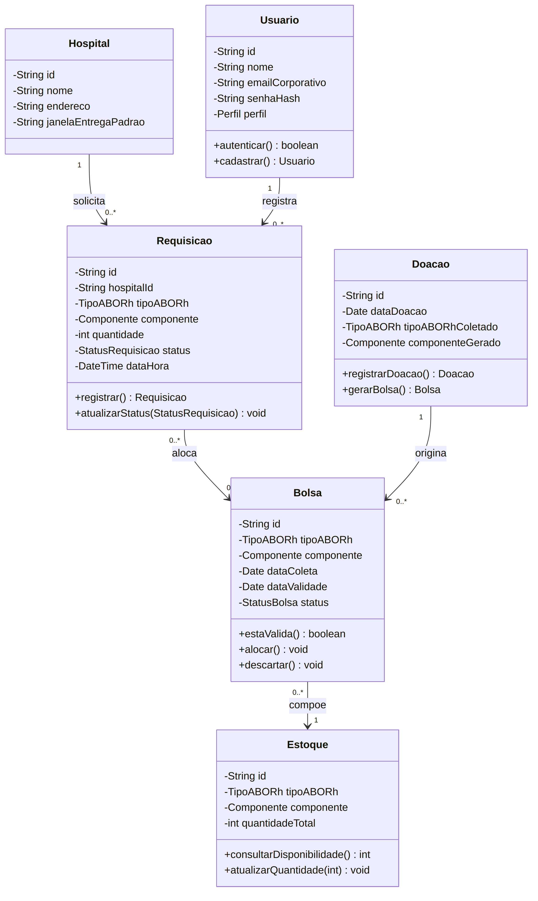
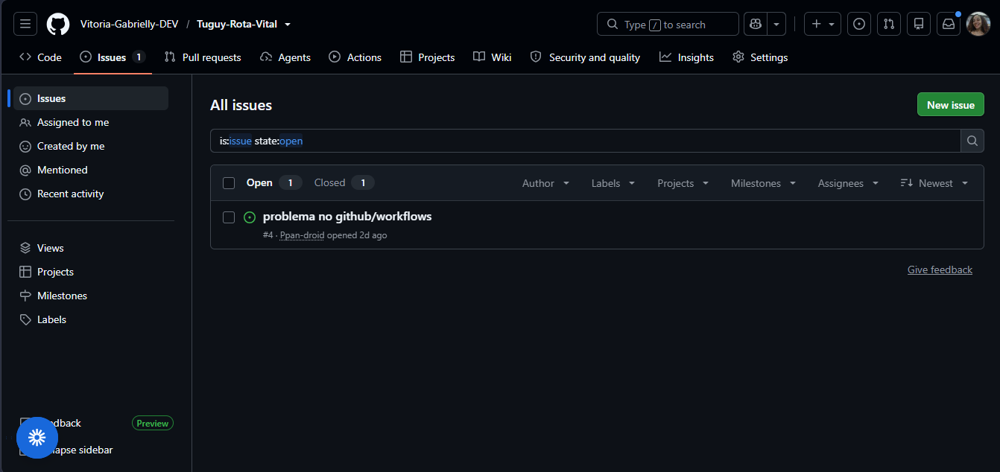

# Rota Vital — Gestão e Distribuição de Hemocomponentes na Rede de Sangue

> Projeto Integrador — 3º Semestre ADS · Squad **Tuguy**
> **Última atualização:** `11/08/2026 — Entrega 02 (POO)`

---

## Sobre o projeto

**Rota Vital** é uma aplicação web que apoia a rede de sangue (inspirada no fluxo da Hemorrede/SUS: coleta/doação → hemocentro → estoque → hospitais) na gestão e distribuição de hemocomponentes.

O sistema gerencia o estoque por tipo e componente, recebe requisições dos hospitais, aloca bolsas compatíveis priorizando a validade (FEFO), calcula rotas de distribuição respeitando a cadeia fria e as janelas de tempo, e monitora temperatura e rede em painéis.

> ⚠️ O projeto utiliza **exclusivamente dados sintéticos** (sem dados reais de doadores/pacientes — LGPD). A telemetria de temperatura/GPS é simulada e a compatibilidade ABO/Rh possui finalidade **didática**, não substituindo protocolos clínicos. Não há integração com sistemas oficiais da Hemorrede.

### Ficha do Projeto

| Campo | Descrição |
|---|---|
| **Problema central** | Garantir o componente certo (compatível e válido), no lugar certo, no tempo certo e na temperatura certa — evitando desabastecimento, descarte por vencimento e risco ao paciente. |
| **Produto esperado** | App web que gerencia estoque, recebe requisições hospitalares, aloca bolsas por compatibilidade + FEFO, calcula rotas respeitando cadeia fria/janelas de tempo, e exibe painéis de estoque/demanda e monitoramento. |
| **Complexidade** | Média (escopo controlado: poucos componentes, grafo limitado, dados sintéticos). |
| **Limites de escopo** | Só dados sintéticos; telemetria simulada; compatibilidade ABO/Rh didática; grafo de rotas limitado; sem integração com sistemas oficiais. |

### Tecnologias Usadas

| Camada | Tecnologia |
|---|---|
| Backend | Java 21, Spring Boot |
| Frontend | HTML, CSS, Thymeleaf |
| Prototipação | Figma |
| Banco de dados | H2 (arquivo local, via Spring Data JPA) |
| Versionamento | Git / GitHub |
| CI/CD | GitHub Actions |

### Como rodar o projeto

**Pré-requisitos:** Java 21 (JDK). O Maven não precisa estar instalado — o projeto inclui o wrapper `mvnw`.

1. Clone o repositório e entre na pasta do back-end:
```bash
   git clone https://github.com/Vitoria-Gabrielly-DEV/Tuguy-Rota-Vital.git
   cd Tuguy-Rota-Vital/back-end/tuguy
```
2. Execute a aplicação:
```bash
   ./mvnw spring-boot:run
```
   (no Windows: `mvnw.cmd spring-boot:run`)

3. Acesse **http://localhost:8080/login**

4. Console do banco H2 (dados em `./data/users-db`): **http://localhost:8080/h2-console**
   - JDBC URL: `jdbc:h2:file:./data/users-db`
   - Usuário: `sa` · Senha: (em branco)

---

## Equipe

| Integrante | Área/Papel no PI | E-mail (@cesar.school) |
|---|---|---|
| Ana Beatriz da Costa | Desenvolvedora | `abblc@cesar.school` |
| Dilvanir Aline Alves de Melo | Desenvolvedora | `dacm@cesar.school` |
| Emanoel Alesandro da Silva | Desenvolvedor | `eas3@cesar.school` |
| Marcio Aureliano da Silva | Desenvolvedor | `maps@cesar.school` |
| Maria Larysse Yasmin Lira | Desenvolvedora | `mlylp@cesar.school` |
| Pedro Pessoa de Albuquerque | Desenvolvedor | `ppan@cesar.school` |
| Vitória Gabrielly Silva | Líder, Desenvolvedora | `vggs@cesar.school` |

**Membros anteriores / que saíram do grupo:** Nenhuma alteração até o momento.

---

## Repositório e links úteis

- **Repositório:** https://github.com/Vitoria-Gabrielly-DEV/Tuguy-Rota-Vital
- **Ambiente/deploy:** *a definir*
- **Quadro de acompanhamento:** https://algs2.atlassian.net/jira/software/c/projects/PI3E3/boards/10 (colunas: Squad | Disciplina | Entrega | Unidade | Semana prevista | Status | Dependências | Riscos | Observações)
- **Planejamento oficial:** `Planejamento_Projeto_Integrador_3.pdf`

---

## Roadmap Geral (Projeto 3)

| Semana | Foco | Disciplinas | Status |
|---|---|---|---|
| 1 | Kickoff do PI e organização das squads | Todas | ✅ |
| 2–3 | Modelagem do domínio e escopo de dados/algoritmos | POO, AED, RSD | ✅ |
| 4–5 | Setup de infraestrutura e início dos algoritmos | SO, RSD, AED | ✅ |
| 6–7 | Primeira sprint — convergência das entregas U1 | Todas | ☐ |
| **8–9** | **Fechamento e checkpoint da Entrega U1** | Todas | ☐ |
| 10–11 | Replanejamento U2 + compatibilidade/integração | POO, AED | ☐ |
| 12–13 | Telemetria, concorrência e painéis | SO, RSD, EST | ☐ |
| 14–15 | Consolidação integrada + preparação da apresentação | Todas | ☐ |
| **16–17** | **Apresentação final e avaliação de processo/colaboração** | Todas | ☐ |

---

## Entregas por Disciplina

> Cada disciplina tem sua própria seção abaixo, com uma subseção **por entrega**, contendo o checklist de itens pedidos e os **links diretos** dos artefatos correspondentes (documentos, protótipos, vídeos, prints). Isso garante que cada professor/monitor encontre rapidamente o material da sua matéria.

### 🩸 POO (Programação Orientada a Objetos)

#### Entrega 01 — 31/08 ✅
- [x] Histórias de usuário (mínimo 7, escritas em `.md`, com detalhes de negócio) → [`docs/historias-usuario.md`](./docs/historias-usuario.md)
- [x] Cenários de aceitação em BDD (Dado-Quando-Então) para cada história → incluídos no mesmo documento acima
- [x] Protótipo Lo-Fi no Figma (mínimo 5 histórias) → [Acessar protótipo](https://www.figma.com/design/U21MRJxsocn9mvfMPw5yEj/Rota-Vital?node-id=0-1&p=f&t=Qi3l1zU3RWARUcw2-0)
- [x] Screencast apresentando o protótipo, explicando cada história (áudio/legenda) → [Assistir no YouTube](https://youtu.be/VXIJSzfzIQQ)

**Histórias mapeadas no protótipo:** HU08 (Login/Cadastro), HU01 (Estoque), Lista de Bolsas, Detalhe da Bolsa, Cadastro de Bolsa, Lista de Doações, Cadastro de Doação, Dashboard.

#### Entrega 02 — 21/09 ☐
- [x] Ao menos 2 histórias implementadas (com descrição formato POST-IT em "Histórias implementadas" abaixo)
- [x] Modelo de domínio documentado (diagrama de classes) → [`docs/diagrama-classes.png`](./docs/diagrama-classes.png) · [fonte editável (.mmd)](./docs/diagrama-classes.mmd)
- [x] Commits frequentes (mínimo semanais) direto na `main`
- [ ] Issue/bug tracker do GitHub atualizado (print anexado)
- [x] Screencast do sistema funcionando (uso) —> [Acessar screencast](https://youtu.be/x03UCdjJq5I)
- [x] Screencast da explicação do código —> [Acessar screencast](https://youtu.be/x03UCdjJq5I)

**Modelo de domínio (entidades, atributos, relacionamentos e cardinalidade):**



- Fonte editável: [`docs/diagrama-classes.mmd`](./docs/diagrama-classes.mmd) — abra em [mermaid.live](https://mermaid.live) para ajustar.

- Regras de negócio no formato regra → serviço/método → exceção → HU de origem: [`Regra de negócio — Rota Vital`](docs/regras-de-negocio.md)

**Histórias implementadas nesta entrega:**
*(preencher no formato: "Como [usuário], eu gostaria de [ação], para [valor]")*
> **HU08 — Cadastrar e acessar o aplicativo**
> Como usuário, eu gostaria de realizar meu cadastro utilizando meu e-mail de trabalho e acessar minha conta por meio de login, para que eu possa utilizar o aplicativo.

> **HU02 — Registrar requisição hospitalar**
> Como funcionário do hemocentro, eu gostaria de registrar requisições de hemocomponentes realizadas pelos hospitais, para que eu possa organizar o atendimento das solicitações.

**Issue/bug tracker:**


[Acessar Issues no GitHub](https://github.com/Vitoria-Gabrielly-DEV/Tuguy-Rota-Vital/issues)

#### Entrega 03 — 19/10 ☐
- [ ] Mais 2 histórias implementadas (descrição formato POST-IT abaixo)
- [ ] Commits frequentes (mínimo semanais)
- [ ] Screencast do sistema funcionando com as novas histórias — link:
- [ ] Screencast da explicação do código das novas histórias — link:
- [ ] Issue/bug tracker atualizado (print anexado)

**Histórias implementadas nesta entrega:**

#### Entrega 04 — 09/11 ☐
- [ ] Histórias restantes implementadas (mínimo 2, descrição formato POST-IT abaixo)
- [ ] Commits frequentes (mínimo semanais)
- [ ] Screencast do uso do sistema (ênfase nas novas histórias) — link:
- [ ] Screencast da explicação do código — link:
- [ ] Issue/bug tracker atualizado (print anexado)

**Histórias implementadas nesta entrega:**

#### Apresentação Final — 09/11 a 13/11 ☐
- [ ] Vídeo/apresentação de até 8 min cobrindo: problema, solução, fluxo de trabalho, ferramentas, lições aprendidas, demonstração do produto — link:

---

### 🧮 AED (Algoritmos e Estruturas de Dados)

#### Unidade 1 (fecha semana 8–9) ☐
- [ ] Grafo + Dijkstra (cálculo de rotas)
- [ ] Hash de estoque
- [ ] Fila de prioridade (FEFO)
- Links dos artefatos:

#### Unidade 2 (fecha semana 15–16) ☐
- [ ] Compatibilidade ABO/Rh integrada
- [ ] Análise de complexidade
- Links dos artefatos:

---

### 📊 EST (Estatística)

#### Unidade 1 ☐
- [ ] Indicadores + análise descritiva + painel inicial
- Links dos artefatos:

#### Unidade 2 ☐
- [ ] Análise probabilística (desabastecimento, descarte) + painel consolidado
- Links dos artefatos:

---

### 🖥️ SO (Sistemas Operacionais)

#### Unidade 1 ☐
- [ ] Pipeline CI/CD + primeiro deploy
- [x] Threads em processo real — ordenação de requisições por prioridade (sequencial × threads × virtual threads)
- Links dos artefatos:
  - Serviço: [`ordenacaorequisicaoservice.java`](./back-end/tuguy/src/main/java/com/rotavital/tuguy/ordenacao/ordenacaorequisicaoservice.java)
  - Endpoint REST: [`ordenacaocontroller.java`](./back-end/tuguy/src/main/java/com/rotavital/tuguy/controller/ordenacaocontroller.java)
  - Como rodar o benchmark: [`docs/como-rodar-benchmark-ordenacao.md`](./docs/como-rodar-benchmark-ordenacao.md)
  - Análise (Big-O, threads, Amdahl): [`docs/analise-ordenacao-threads.md`](./docs/analise-ordenacao-threads.md)

#### Unidade 2 ☐
- [ ] Arquitetura em 3 cenários + orçamento + sincronização
- Links dos artefatos:

---

### 🌐 RSD (Redes e Sistemas Distribuídos)

#### Unidade 1 ☐
- [ ] Diagrama de topologia + requisitos de rede
- [ ] Protocolos/APIs definidos
- Links dos artefatos:

#### Unidade 2 ☐
- [ ] Benchmarking (latência/vazão/erros) + painel de rede + plano de migração
- Links dos artefatos:

---

## Status por Disciplina (atualizar semanalmente)

| Disciplina | Entrega em foco | Status | Bloqueios | Próximo passo |
|---|---|---|---|---|
| POO | Entrega 01 | 🟢 | — | Iniciar implementação (Entrega 02) |
| AED | Unidade 1 | 🔴/🟡/🟢 | | |
| EST | Unidade 1 | 🔴/🟡/🟢 | | |
| SO | Unidade 1 | 🔴/🟡/🟢 | | |
| RSD | Unidade 1 | 🔴/🟡/🟢 | | |

🟢 no prazo · 🟡 atenção · 🔴 bloqueado/atrasado

---

## Riscos Ativos

| Risco | Impacto | Mitigação em andamento |
|---|---|---|
| App virar CRUD sem integração dos algoritmos | Alto | |
| Grafo de rotas grande demais | Médio | |
| Compatibilidade ABO/Rh simplista | Médio | |
| Deploy/CI-CD deixado para o fim | Alto | |
| Telemetria/painéis desconectados do app | Médio | |

---

## Checkpoints de Comunicação Docente

- Reunião quinzenal Projeto ↔ disciplinas técnicas: semanas 3, 5, 7, 9, 11, 13, 15
- Checkpoint de integração U1: semana 8–9 · U2: semana 15–16

---

## Estrutura de pastas sugerida no repositório
```
/docs
  historias-usuario.md      # Histórias de usuário + critérios BDD (POO)
  diagrama-classes.png      # Diagrama de classes do modelo de domínio (POO — U1)
  diagrama-classes.mmd      # Código-fonte Mermaid do diagrama (editável)
  /prints                   # Prints do issue/bug tracker, telas etc.
/src                         # Código-fonte da aplicação Spring Boot
README.md                    # Este arquivo
```
